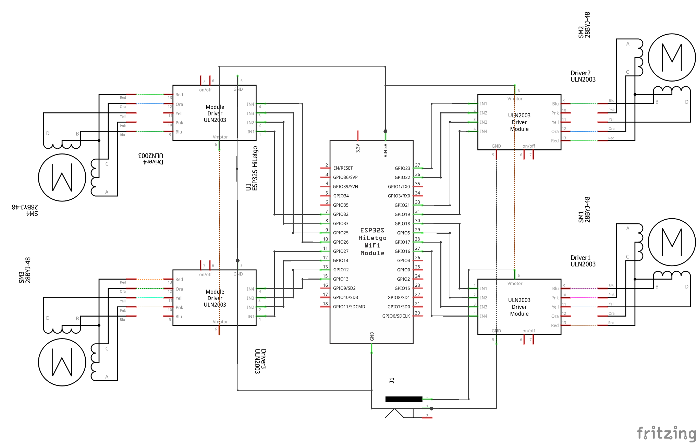

# Location Clock

Location Clock is inspired by a love of all things magical, and scientific. A combination of reading Harry Potter with my 8 year old and her "simple machines"
STEM lessons in school, we decided to embark on building our very own physical location clock. Already having Home Assistant setup and configured for my wife
and I, we chose to build upon that along with ESPHome.

You can follow along here to build your own.

## Inspiration

For this project, I drew inspiration from the following similar projects

1. [Magic Clock](https://github.com/brgerig/Magic-Clock): Most of the 3D print files for the assembly were used and/or remixed from here.
2. [Printable Props](https://printableprops.jimdo.com/en/harry-potter/weasley-clock/): Pascal Böcker graciously shared the STLs for the clock hands with me.

## Parts

| Part                                                   | Quantity    | Price       | My Source     |
|--------------------------------------------------------|-------------|-------------|---------------|
| [nodemcu-32s dev board (38 pin)][1]                    | 1           | $7-$12      | Amazon        |
| [ULN2003 Board w/ Stepper Motor][2]                    | 4           | $10-$14     | Amazon        |
| [Female to Female Jumper Wires][3]                     | ~26         | $5-7        | Amazon        |
| [6V 2A AC/DC Adapter w/ Breakout][4]                   | 1           | $10-20      | Amazon        |
| [Aluminum Telescopic Tubes][5] (1/8, 5/32, 3/16, 7/32) | 1 each size | $7-9        | Amazon        |
| Transparent Paper Sheet                                | 1           | < $1        | On Hand       |
| Transparent Vinyl Sticker Sheet                        | 1           | < $1        | On Hand       |
| #10-24 x 3" Machine Screws                             | 4           | $2-$4       | Big Box Store |
| #10-24 T-Nuts                                          | 4           | $1-$2       | Big Box Store |
| #10-24 Nuts                                            | 24          | $2-$4       | Big Box Store |
| Small Wood Screws                                      | 6           | $1-$2       | Big Box Store |
| 1/2" MDF/Wood Block/Plywood/Scrap Wood                 | 1           | ?           | On Hand       |
| White Spray Paint                                      | 1           | ?           | On Hand       |
| Metallic Silver Spray Paint                            | 1           | ?           | On Hand       |
| Super Glue & Wood Glue                                 | 1           | ?           | On Hand       |
| Old Clock Body (Mine was a Regulator 1114c)            | 1           | $25-$35     | Facebook      |
| **Total**                                              |             | **< $100**  |               |

## 3D Printed Parts

| Part                                                             | Quantity |
|------------------------------------------------------------------|----------|
| ULN2003 dual case ([base][6], [cover][7])                        | 2        |
| [Mounting Bracket Base][8]                                       | 1        |
| Mounting Bracket Top ([clean][9] or [threaded][10] & [plug][11]) | 1        |
| [Spur Gear 5mm][12]                                              | 4        |
| [Spur Gear 1/8][13]                                              | 1        |
| [Spur Gear 5/32][14]                                             | 1        |
| [Spur Gear 3/16][15]                                             | 1        |
| [Spur Gear 7/32][16]                                             | 1        |
| Clock Hands (not mine to share)                                  | 4        |

## Tools & Supplies

- Phillips Screwdriver
- Exacto Knife
- Super Glue
- Wood Glue
- Spray Paint (White & Metallic Silver)
- Hand saw w/ metal cutting blade
- Drill & bits
- Pick (helps remove staples)
- (optional) Bench Grinder

## Software

The SVGs in the [graphics folder](https://github.com/hunterjm/location-clock/tree/main/graphics) were created in Inkscape and are editable to change your locations and names. The `names.svg` file has a hidden layer with a to-scale copy of the clock hands I printed for alignment.

## Wiring Diagrams

### Breadboard

### Schematic

## The Build

Assembly of the control mechanism was the most difficult part of this project, and I did not take near enough pictures or notes of the process. That being said, a lot of it
is pretty self explanitory, so I will give a general overview of the steps I took and some gotchas along the way.

### Clock Tear Down

1. 4 screws held the glass assembly of the clock face on from the inside of the body.
2. The clock hands pull right off - they require some pressure.
3. Remove the nut from the clock face, and the old time mechanism should come right out.
4. The glass was held in with a plastic support held by two small screws. Remove the glass so it doesn't break. I also used a razor blade to scrape off the "REGULATOR" text from the glass.
5. The face was held on with 4 L brackets on the side of the clock. I removed it for easier access to build the mechanism.
5. The clock face was attached with some double sided tape and pulled right off.
6. There was a pre-existing 1/2 block of wood in the clock body that was too small and needed to be removed. It was held on with 2 staples, but no glue. I used a pick to pull the staples out.

[1]: <https://www.amazon.com/dp/B0718T232Z>
[2]: <https://www.amazon.com/dp/B015RQ97W8>
[3]: <https://www.amazon.com/dp/B01L5ULRUA>
[4]: <https://www.amazon.com/dp/B08VWG1S1V>
[5]: <https://www.amazon.com/dp/B07VS4823F>
[6]: <https://github.com/hunterjm/location-clock/blob/main/stl_files/ULN2003-dual.stl>
[7]: <https://github.com/hunterjm/location-clock/blob/main/stl_files/ULN2003-dual-cover.stl>
[8]: <https://github.com/hunterjm/location-clock/blob/main/stl_files/mounting-bracket-base.stl>
[9]: <https://github.com/hunterjm/location-clock/blob/main/stl_files/mounting-bracket-top.stl>
[10]: <https://github.com/hunterjm/location-clock/blob/main/stl_files/mounting-bracket-top-threaded.stl>
[11]: <https://github.com/hunterjm/location-clock/blob/main/stl_files/mounting-bracket-top-threaded-plug.stl>
[12]: <https://github.com/hunterjm/location-clock/blob/main/stl_files/spur_gear_5mm.stl>
[13]: <https://github.com/hunterjm/location-clock/blob/main/stl_files/spur-gear-1-8th.stl>
[14]: <https://github.com/hunterjm/location-clock/blob/main/stl_files/spur-gear-5-32nd.stl>
[15]: <https://github.com/hunterjm/location-clock/blob/main/stl_files/spur-gear-3-16th.stl>
[16]: <https://github.com/hunterjm/location-clock/blob/main/stl_files/spur-gear-7-32.stl>